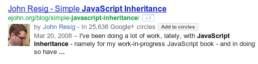
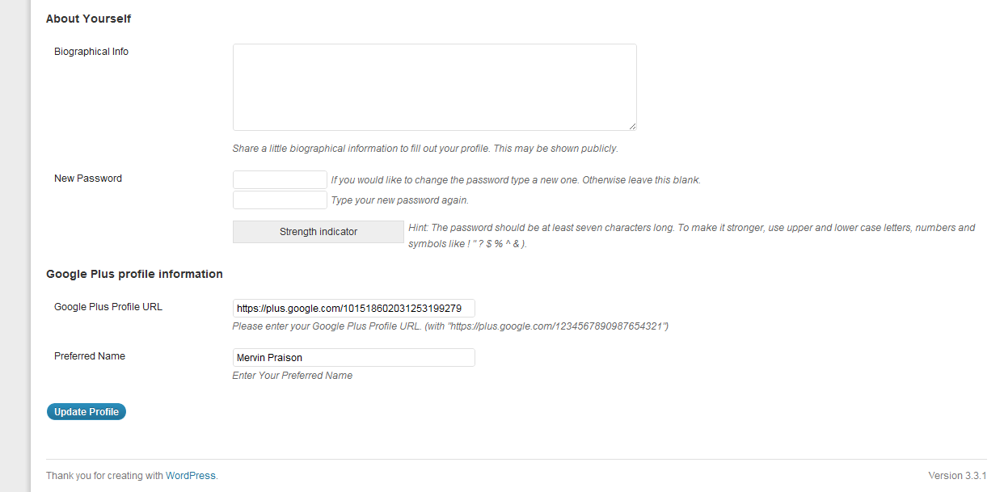
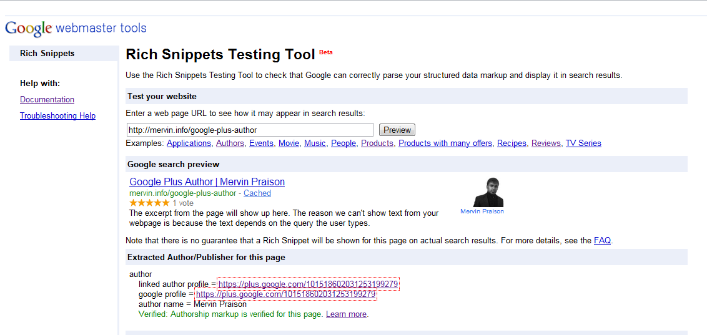

# WP Google Authorship - WordPress Plugin

[](https://wordpress.org/plugins/google-plus-author/)
[](https://wordpress.org/)
[](https://www.gnu.org/licenses/gpl-2.0.html)

Make your Google Plus profile picture appear in Google Search results with proper authorship markup. Easy 4-step setup with support for multiple authors and multisite installations.

## 🌟 Features

- ✅ **Google Authorship Markup** - Proper rel="author" implementation
- ✅ **Profile Picture in Search** - Your Google+ photo appears in search results
- ✅ **Multiple Authors** - Each author can have their own Google+ profile
- ✅ **Multisite Compatible** - Works seamlessly with WordPress multisite
- ✅ **Easy Setup** - Just 4 simple steps to implement
- ✅ **Shortcode Support** - `[googleplusauthor]` for flexible placement
- ✅ **PHP Function** - `google_plus_author()` for theme integration
- ✅ **Preferred Name** - Custom display name option
- ✅ **Secure** - Nonce verification and input sanitization
- ✅ **WordPress 6.8 Compatible** - Fully tested and updated

## 📦 Installation

### From WordPress.org

1. Go to **Plugins → Add New**
2. Search for "WP Google Authorship"
3. Click **Install Now** and then **Activate**

### Manual Installation

1. Download the plugin zip file
2. Extract the contents
3. Upload the `google-plus-author` folder to `/wp-content/plugins/`
4. Activate the plugin through the **Plugins** menu in WordPress

### From GitHub

```bash
cd wp-content/plugins/
git clone https://github.com/MervinPraison/google-plus-author.git
```

## 🚀 Quick Start (4 Steps)

### Step 1: Install & Activate

Install the plugin from WordPress.org or upload manually.

### Step 2: Add Your Google+ Profile URL

1. Go to **Users → Your Profile**
2. Scroll to "Google Plus profile information"
3. Enter your Google Plus Profile URL
   - Format: `https://plus.google.com/1234567890987654321`
4. (Optional) Enter your preferred name
5. Click **Update Profile**

### Step 3: Add to Your Theme

Choose one of these methods:

#### Method A: Using Shortcode

Add to your post/page content or widget:

```
[googleplusauthor]
```

#### Method B: Using PHP Function

Add to your theme template (e.g., `single.php`, `author.php`):

```php
<?php if ( function_exists('google_plus_author') ) google_plus_author(); ?>
```

### Step 4: Verify

Check your published posts to see the authorship link with `rel="author"` attribute.

## 💡 Usage Examples

### In Post Content

Simply add the shortcode:

```
Written by [googleplusauthor]
```

### In Theme Template

Add to your `single.php` or `author.php`:

```php
<div class="author-info">
    <span class="author-label">Author:</span>
    <?php if ( function_exists('google_plus_author') ) google_plus_author(); ?>
</div>
```

### In Author Bio

Add to your author template:

```php
<div class="author-bio">
    <h3>About <?php the_author(); ?></h3>
    <p><?php the_author_meta('description'); ?></p>
    <p>Connect: <?php google_plus_author(); ?></p>
</div>
```

## 📋 Requirements

- **WordPress:** 3.0 or higher
- **PHP:** 5.6 or higher (7.4+ recommended)
- **Google+ Profile:** Active Google Plus account

## 🔧 Configuration

### User Profile Settings

Each user can configure:

1. **Google Plus Profile URL** (Required)
   - Your full Google+ profile URL
   - Example: `https://plus.google.com/1234567890987654321`

2. **Preferred Name** (Optional)
   - Custom display name for authorship
   - Falls back to WordPress display name if not set

### Multiple Authors

Perfect for multi-author blogs:

- Each author sets their own Google+ profile
- Automatic author detection per post
- Correct `rel="author"` or `rel="me"` based on context

### Multisite Support

Works seamlessly with WordPress multisite:

- Each site can have different authors
- Per-site configuration
- Network-wide compatibility

## 🔒 Security Features

### Version 2.1 Security Fixes

- ✅ Added nonce verification for form submissions
- ✅ Input sanitization with `esc_url_raw()` and `sanitize_text_field()`
- ✅ Proper output escaping with `esc_url()`, `esc_attr()`, `esc_html()`
- ✅ Replaced deprecated `get_currentuserinfo()` with `wp_get_current_user()`
- ✅ Replaced deprecated `update_usermeta()` with `update_user_meta()`

## 📝 Changelog

### Version 2.1 (2025-01-08)

**Security Fixes:**
- Added nonce verification for form submissions
- Input sanitization with `esc_url_raw()` and `sanitize_text_field()`
- Proper output escaping with `esc_url()`, `esc_attr()`, `esc_html()`

**Improvements:**
- Replaced deprecated `get_currentuserinfo()` with `wp_get_current_user()`
- Replaced deprecated `update_usermeta()` with `update_user_meta()`
- Added text domain for translations
- WordPress 6.8 compatibility tested
- Updated license to GPLv2 or later

### Version 2.0
- Previous stable version

## 🎨 Customization

### Styling the Author Link

The plugin outputs a simple anchor tag. Style it with CSS:

```css
a[rel="author"] {
    color: #4285f4;
    text-decoration: none;
    font-weight: bold;
}

a[rel="author"]:hover {
    text-decoration: underline;
}
```

### Custom Output Format

Modify the output by editing your theme:

```php
<div class="google-author">
    <span class="g-icon">G+</span>
    <?php google_plus_author(); ?>
</div>
```

## 🌐 SEO Benefits

### Google Authorship

- **Rich Snippets:** Your photo appears in search results
- **Trust Signals:** Verified authorship builds credibility
- **Click-Through Rate:** Photos increase CTR by up to 150%
- **Author Rank:** Contributes to Google's author authority

### Proper Markup

The plugin automatically adds:

- `rel="author"` on author pages
- `rel="me"` on other pages
- Proper title attributes
- Escaped and validated URLs

## 🐛 Bug Reports & Feature Requests

Found a bug or have a feature request?

- **GitHub Issues:** [Report here](https://github.com/MervinPraison/google-plus-author/issues)
- **WordPress.org Support:** [Support Forum](https://wordpress.org/support/plugin/google-plus-author/)

## 👨‍💻 Development

### Repository Structure

```
google-plus-author/
├── google-plus-author.php    # Main plugin file
├── readme.txt                # WordPress.org readme
├── README.md                 # This file
├── screenshot-1.png          # Profile settings
├── screenshot-2.png          # Meta box
└── screenshot-3.png          # Frontend display
```

### Function Reference

#### `google_plus_author()`

Echoes the Google+ author link.

```php
<?php google_plus_author(); ?>
```

#### `google_plus_author_short()`

Returns the Google+ author link (for use in shortcode).

```php
$author_link = google_plus_author_short();
echo $author_link;
```

### Contributing

Contributions are welcome! Please:

1. Fork the repository
2. Create a feature branch (`git checkout -b feature/AmazingFeature`)
3. Commit your changes (`git commit -m 'Add some AmazingFeature'`)
4. Push to the branch (`git push origin feature/AmazingFeature`)
5. Open a Pull Request

## ⚠️ Important Notes

### Google+ Deprecation

**Note:** Google+ was shut down in April 2019. This plugin is maintained for legacy purposes and historical compatibility. For modern author markup, consider using:

- Schema.org Person markup
- WordPress author archives
- Social media profile links

### Data Storage

- Profile URLs stored in user meta as `gplusauthor`
- Preferred names stored in user meta as `prefname`
- No external API calls
- All data stored locally in WordPress database

## 📄 License

This plugin is licensed under the GPLv2 or later.

```
Copyright 2012-2025 Mervin Praison

This program is free software; you can redistribute it and/or modify
it under the terms of the GNU General Public License, version 2, as
published by the Free Software Foundation.

This program is distributed in the hope that it will be useful,
but WITHOUT ANY WARRANTY; without even the implied warranty of
MERCHANTABILITY or FITNESS FOR A PARTICULAR PURPOSE. See the
GNU General Public License for more details.
```

## 👤 Author

**Mervin Praison**
- Website: [mer.vin](https://mer.vin)
- GitHub: [@MervinPraison](https://github.com/MervinPraison)
- WordPress.org: [mervinpraison](https://profiles.wordpress.org/mervinpraison/)

## 🔗 Links

- **WordPress.org:** https://wordpress.org/plugins/google-plus-author/
- **GitHub Repository:** https://github.com/MervinPraison/google-plus-author
- **Support Forum:** https://wordpress.org/support/plugin/google-plus-author/
- **Documentation:** https://mer.vin/google-plus-author
- **Author Website:** https://mer.vin

## ⭐ Support

If you find this plugin useful, please consider:

- ⭐ [Leaving a review](https://wordpress.org/support/plugin/google-plus-author/reviews/)
- 🐛 [Reporting bugs](https://github.com/MervinPraison/google-plus-author/issues)
- 💡 [Suggesting features](https://github.com/MervinPraison/google-plus-author/issues)
- 💰 [Making a donation](https://mer.vin)

## 📸 Screenshots


*Configure your Google+ profile URL in user settings*


*Easy-to-use meta box interface*


*Author link with proper rel attribute*

---

**Made with ❤️ for the WordPress community**
