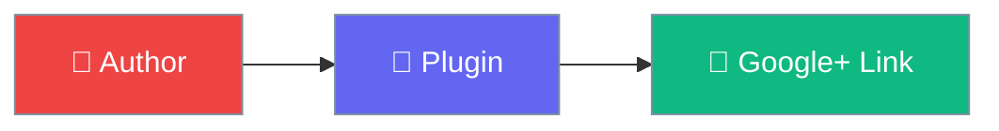

# WP Google Authorship

Link author profiles to Google Plus.

## Quick Start

1. **Install** → Upload plugin
2. **Configure** → Add Google+ URL in profile
3. **Display** → Use `[googleplusauthor]` shortcode

## Features

| Feature | Description |
|---------|-------------|
| 👤 Profile | User profile fields |
| 🔗 Shortcode | `[googleplusauthor]` |
| 👥 Multi-author | Multiple author support |

## Next Steps

- [Installation](getting-started/installation.md)
- [Usage Guide](getting-started/usage.md)
